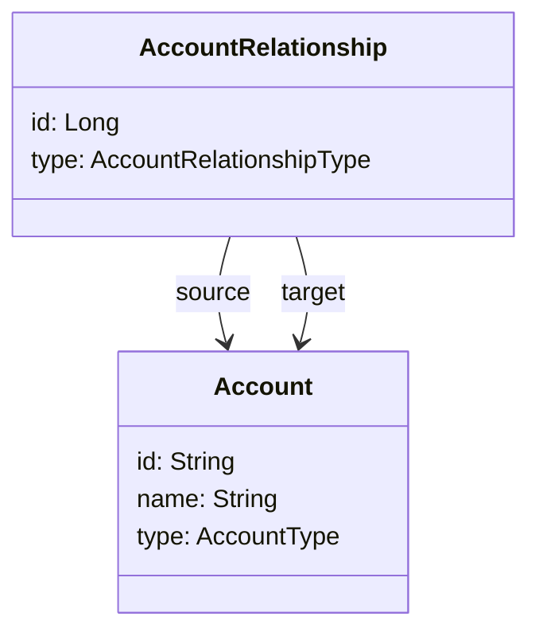
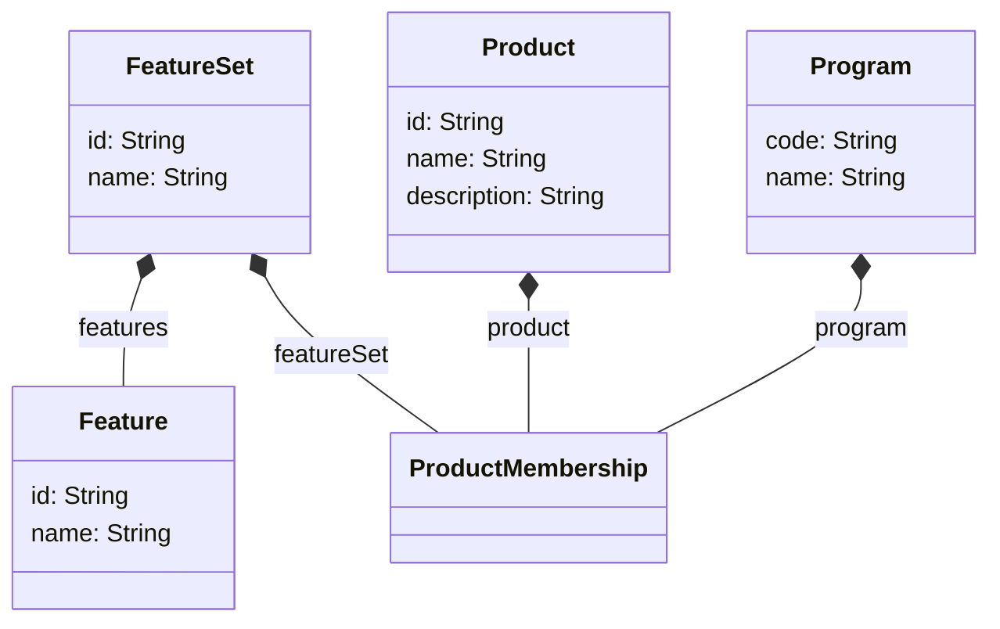

# Data model

## Organization
An (educational) organization is a graph with `Account` entities representing the nodes and `AccountRelationShip` mapping the edges.

The class `OrganizationService` deals with managing the organization graph in a consistent way.

Main rules are:
- There is only one Account of type `DISTRICT`
- A district `HAS` different School accounts
- A school `HAS` different classes
- An individual is `ENROLLED_IN` class, school, and district accounts

## FeatureSet Bundles, Products, and Features

`Features` represent reusable functionalities or content that can be grouped into a `FeatureSet`, and multiple products can be packaged into a `Product` according to some `Program` of study.

The `ProductMembership` class tracks the triple `<Product, FeatureSet, Program>`.

