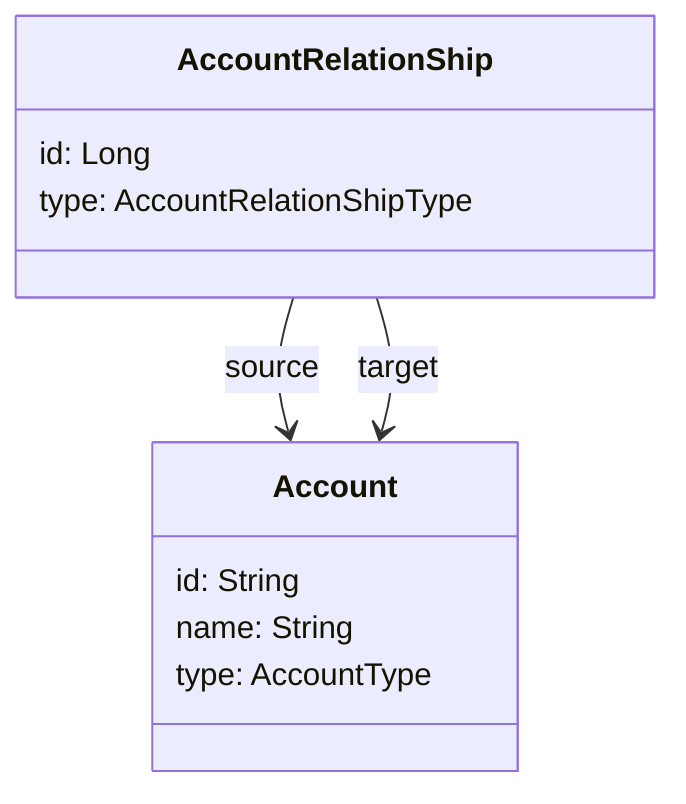

# Data model

## Organization
An (educational) organization is a graph with `Account` entities representing the nodes and `AccountRelationShip` mapping the edges.

The class `OrganizationService` deals with managing the organization graph in a consistent way.

Main rules are:
- There is only one Account of type `DISTRICT`
- A district `HAS` different School accounts
- A school `HAS` different classes
- An individual is `ENROLLED_IN` class, school, and district accounts

